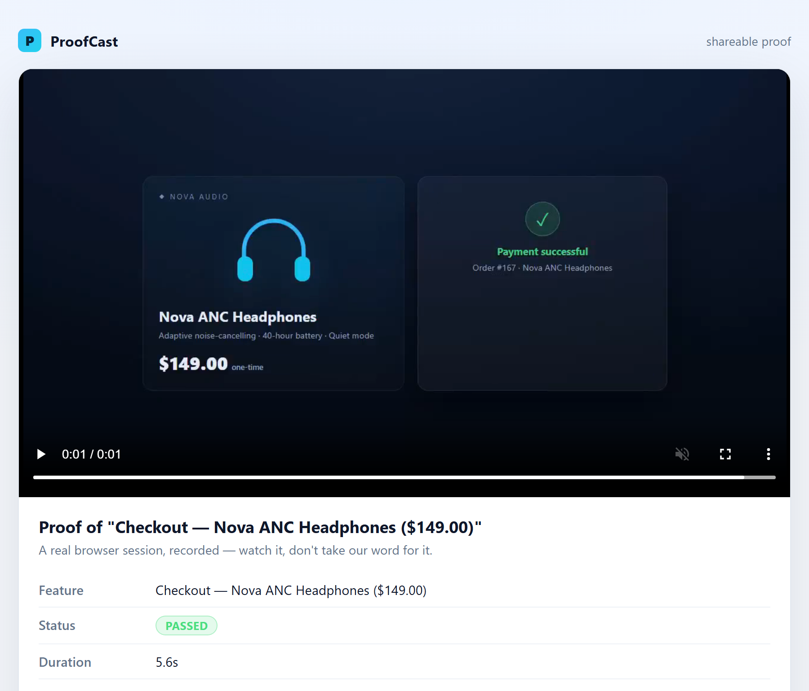
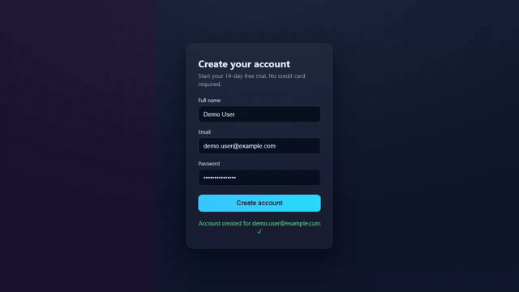

<div align="center">

# ProofCast

### The trust layer for autonomous software agents.

**Agents can write code and ship it. ProofCast makes them prove it works first — on video, in a real browser — before anything reaches production.**

[](https://github.com/marketplace/actions/proofcast-proof-in-your-pr)
[](https://www.npmjs.com/package/proofcast)
[](https://github.com/guillaumeCode2012/proofcast/actions/workflows/ci.yml)
[](https://github.com/guillaumeCode2012/proofcast/actions/workflows/proof.yml)


[](https://www.buymeacoffee.com/guillaume_code) &nbsp; [](https://x.com/GuillaumeP86859)

[Quickstart](#quickstart-a-real-proof-in-2-minutes) · [CI](#add-proof-to-your-ci) · [The problem](#the-problem) · [The solution](#the-solution) · [How it works](#how-it-works) · [Architecture](#architecture) · [Installation](#installation) · [Status](#current-status)

<br/>


<sub>Real recording, real Chromium, real pipeline. Not a mockup.</sub>

</div>

<br/>

```
you:        "Build a checkout page"

ProofCast:  Build → Run → Record → Prove → Deploy
            ────────────────────────────────────
            🧠 generates the code
            📦 boots it in an isolated container
            🌐 drives it in real Chromium
            🎥 records the interaction as MP4
            ✅ only then — deploys
```

---

## Quickstart: a real proof in 2 minutes

Want to see ProofCast actually work before wiring up anything? Prove a bundled
example — **no API key, no Telegram, no Vercel, and no Docker required:**

```bash
git clone https://github.com/guillaumeCode2012/proofcast.git
cd proofcast
npm install
npm run demo          # == npx proofcast demo --share
```

ProofCast boots a bundled example — a product **checkout**
([examples/checkout](examples/checkout)) — drives it in a **real Chromium** (types
the test card `4242 4242 4242 4242`, clicks *Pay $149.00*, and watches the payment
succeed), records the session, and transcodes it to an **MP4**. With `--share` it
also writes a self-contained, shareable proof page. It prints one JSON line:

```json
{ "success": true, "proofPath": ".../proofcast-demo-proof.mp4", "sharePath": ".../proof-<id>/index.html", "durationMs": 4900 }
```

Exit code `0` means the proof passed. Open the MP4 — or open `sharePath` in a
browser — and watch it. That is the whole point: **evidence you can play, not a
checkmark you trust.** Point `proofcast run` at your **own** project the same way:

```bash
npx proofcast run ./path/to/your-app --share --open
```

> `proofcast run` / `demo` is the **pure prover**: it only proves code and makes no
> AI call, which is why this trial needs no provider key. Generating a feature
> (`proofcast generate`) or shipping one (`Déploie`) is the configured path — see
> [Installation](#installation) below.

### Shareable proofs



Add **`--share`** to any command to get a portable `proof-<id>/` folder: a
self-contained `index.html` that plays the recorded MP4 and shows the report —
feature, pass/fail, duration, timestamp — with no backend and no CDN, so it works
by opening the file directly (`file://`) **and** on any static host. Its path comes
back on stdout as `sharePath`. Add **`--open`** to pop it straight into your
default browser.

---

## See it work

Three real apps, three real proofs. **Every GIF below is an actual ProofCast
recording**, produced by the exact command printed under it — no API key, no
Docker, no signup, nothing to install beyond `npm install`. Clone the repo and you
get the same three videos, on **macOS, Linux and Windows** alike.

Each example is a self-contained, zero-dependency app (Node's built-in `http`
server only), so it boots in a second and pulls nothing from the network.

### 1. Signup — the account is really created



ProofCast fills [examples/signup](examples/signup) the way a user would, submits,
and watches the page confirm **“Account created for demo.user@example.com ✓”**.

```bash
npx proofcast run ./examples/signup
```

### 2. Checkout — the payment really goes through


ProofCast types the test card `4242 4242 4242 4242` into
[examples/checkout](examples/checkout), clicks *Pay $149.00*, and waits out the
async payment until it settles on **“Payment successful”** with a real order number.

```bash
npx proofcast run ./examples/checkout
```

### 3. Task list — the item really lands in the list


No password, no card — just a feature. ProofCast types a task into
[examples/todo](examples/todo), clicks *Add task*, and watches the list actually
grow: the item appears and the counter goes from **“0 tasks”** to
**“1 open · 1 total”**.

```bash
npx proofcast run ./examples/todo
```

Each run prints one JSON line and exits `0` only if the proof passed:

```json
{ "success": true, "proofPath": ".../examples/todo/proofcast-proof.mp4", "durationMs": 3380 }
```

Add `--share --open` to any of them to get the portable proof page and pop it
straight into your browser. Point the same command at **your own** project:

```bash
npx proofcast run ./path/to/your-app --share --open
```

> These three are also the CI guard: `npm test` boots each one in real Chromium
> and asserts the proof comes back `success: true`, so a gallery entry can never
> quietly rot into a broken example.

### On ports (and why a proof can refuse to run)

ProofCast picks a **free port** for every run and passes it to your project as
`$PORT` — so proving something never collides with the dev server you already
have on `:3000`, and several proofs can run at once.

If the port it is told to use is **already serving something**, ProofCast stops
instead of proving. That refusal is deliberate: a server that is already up is
indistinguishable from your project having booted, so continuing would record
*that other application* and report it as a passing proof. A proof of the wrong
code is worse than no proof, so this one fails closed:

```
Le port 3000 est déjà utilisé par un autre processus — impossible d'y démarrer
le projet à prouver. ProofCast refuse de continuer : la preuve enregistrerait
l'application de ce processus, pas la tienne.
```

---

## Add proof to your CI

Reviewers approve diffs. They almost never *run* the thing. The
[**ProofCast GitHub Action**](https://github.com/marketplace/actions/proofcast-proof-in-your-pr)
closes that gap: on every pull request it boots your app, drives the feature in real
Chromium, records it, and puts the result **in the PR itself**.

Drop this in `.github/workflows/proof.yml`:

```yaml
name: Proof

on: pull_request

permissions:
  contents: read
  pull-requests: write # post the proof comment
  statuses: write # publish the proofcast/proof check

jobs:
  proof:
    runs-on: ubuntu-latest
    steps:
      - uses: actions/checkout@v4
      - uses: guillaumeCode2012/proofcast@v1
        with:
          path: . # the app to prove
```

That is the whole setup. **No secret to configure** — recording a proof makes no AI
call, and the built-in `GITHUB_TOKEN` is enough to comment and set the check. **No
install step either:** the action is self-contained, running the ProofCast bundled at
the ref you pinned, so `@v1` can never drift from the tool it ships. Your app only
needs to boot with `npm install && npm run build && npm run start`.

Every pull request then gets three things:

| | |
| :-- | :-- |
| 💬 **A comment** | The report — feature, ✅/❌, duration — with a link to the video. Re-runs **edit** that comment instead of stacking new ones. |
| 🎥 **An artifact** | The recorded **MP4**, plus the self-contained shareable page, downloadable from the run. |
| ✅ **A check** | `proofcast/proof`, green or red from the report. Make it a required check and *"it works"* stops being a claim. |

<details>
<summary><b>All inputs</b> (every one is optional)</summary>

| Input | Default | What it does |
| :-- | :-- | :-- |
| `path` | `.` | Directory of the app to prove. |
| `version` | `bundled` | Run the ProofCast shipped with the action at the ref you pinned — self-contained, always version-matched. Or pin a release (`latest`, `0.5.0`, any npm spec). |
| `execution` | `local` | `local`, or `docker` for container isolation (pulls `node:20-alpine`). |
| `artifact-name` | `proofcast-proof` | Name of the artifact holding the video. |
| `retention-days` | `30` | How long the proof is kept. |
| `comment` | `true` | Post/update the PR comment. |
| `status-check` | `true` | Publish the `proofcast/proof` commit status. |
| `fail-on-error` | `true` | Fail the job on a failed proof. `false` reports without blocking. |
| `github-token` | `${{ github.token }}` | Token used to comment and set the check. |

Outputs: `success`, `duration-ms`, `proof-path`, `artifact-url`.

**Pull requests from forks.** GitHub gives `pull_request` runs from a fork a
read-only token, so the comment and the check cannot be published — by design, and no
`permissions:` block changes it. ProofCast still *proves* the PR: the video artifact
and the job summary are there, and the action says so in a warning rather than
failing silently. (The usual workaround, `pull_request_target`, runs untrusted code
with a write token — don't reach for it without understanding that trade-off.)

The action needs a standard `ubuntu-latest` runner and installs Chromium itself;
ffmpeg ships bundled with ProofCast. A ready-to-copy workflow lives in
[examples/github-action/proof.yml](examples/github-action/proof.yml), and this repo
[proves itself with it](.github/workflows/proof.yml) on every PR.

Releasing the action is documented in
[docs/publishing-the-action.md](docs/publishing-the-action.md).

</details>

---

## The problem

Autonomous agents can write and ship software now. That part is solved. What's missing is a reason to believe the result actually works.

An agent can say **"Done ✅"** while:
- the feature doesn't do what was asked
- the button throws on click
- the signup flow 500s on submit
- the deploy is broken and nobody looked

None of the usual signals close that gap:

| Signal | What it actually proves |
|---|---|
| Passing tests | The code the model chose to test behaves as the model expected |
| Green CI | It *built* — not that it *works* |
| "I ran it, looks good" | Nothing, the moment the terminal scrolls |
| A screenshot | One frozen frame; the bug lives in the interaction |

We automated *writing* software long before we automated *trusting* it. That gap doesn't close with a faster or smarter agent — it closes with evidence.

---

## The solution

**Agents create. ProofCast proves.**

ProofCast sits between the agent and production. It takes the instruction, builds the feature, runs it for real, records what happened, and only lets a deploy through if the proof exists. No proof, no deploy — no exceptions, no override.

It isn't a linter, a test runner, or a screen recorder bolted onto a pipeline. It's an autonomous agent in its own right — with memory, tools, and judgment — defined by the one discipline most agents skip: **it stops to prove its work before it ships.**

---

## How it works

```
 1. BUILD     natural-language request → generated feature (multi-provider LLM)
 2. RUN       boots the project inside an isolated Docker container
 3. OBSERVE   drives it in real Chromium — clicks, fills forms, navigates
 4. RECORD    captures the interaction and transcodes it to MP4
 5. VERIFY    console errors, page exceptions, HTTP 5xx → self-repair (≤ 3 attempts)
 6. DEPLOY    only if a passing proof exists this session — otherwise: blocked
```

```
"Démo a signup page"
        │
        ▼
┌──────────────────── ProofCast (autonomous) ────────────────────┐
│  orchestrate   the model builds the feature (memory-informed)   │
│  run           serve it, drive it in real Chromium              │
│  record        capture the real interaction → MP4               │
│  verify        console errors / exceptions / 5xx → self-repair  │
└─────────────────────────────┬────────────────────────────────────┘
                               ▼
        ▶ proof.mp4 lands in Telegram · session marked demo-ready
                               │
"Déploie"                     ▼
        └──────► proof exists? ──► deploy ──► ✅ production URL
                     └─ no ────► ✋ blocked until a proof exists
```

---

## Why ProofCast is different

- **Real-browser proof, not a claim.** Every proof is a genuine Chromium session (Playwright), recorded and transcoded to MP4 — something you watch, not a checkmark you trust.
- **Docker isolation.** Every run boots in a throwaway `node:20-alpine` container. Generated code never touches your machine, and the container is always torn down — success, failure, or crash.
- **Self-repair loop.** Runtime errors are fed back to the model automatically, bounded to 3 attempts with a global timeout. Never an infinite loop.
- **Proof-gated deployment.** The deploy gate is a fail-closed guard: if the gate itself breaks, the default is *no deploy*, never a silent pass.
- **Persistent memory.** Project-scoped, redacted, injected back into every prompt — so the agent learns from its own past failures instead of repeating them.
- **Multi-provider, never pre-chosen.** Anthropic, OpenAI, or any compatible endpoint. Your environment picks the model; ProofCast never does.
- **Works alongside your existing agent.** ProofCast ships a machine-readable runbook (`AGENTS.md`) that Claude Code, Codex, and Cursor read directly — it bootstraps once, then runs on its own.

---

## Example workflow

<table>
<tr>
<th align="left">A typical autonomous agent</th>
<th align="left">ProofCast</th>
</tr>
<tr>
<td valign="top">

<pre>
you:    "add a signup page and ship it"
agent:  "Done ✅ — deployed to production."

you:    (opens the site, hopes)
        (it 500s on submit)
</pre>

</td>
<td valign="top">

<pre>
you:    "Démo a signup page"
agent:  🎬 building… 🎥 recording proof…
tg:     ▶ proof.mp4  ·  0:11
        (you watch it type an email and submit)
you:    "Déploie"
agent:  ✅ https://acme.vercel.app
</pre>

</td>
</tr>
</table>

`Démo` and `Déploie` — French for *demo* and *deploy* — are the whole interface. **`Déploie` is blocked until a `Démo` proof exists this session.** No override.

---

## Architecture

```
                          ┌─  ai          orchestration: provider, memory, generation
        ┌──── bot ────────┤
setup ──┤  Démo / Déploie  ├─  video       Playwright → real Chromium → MP4 proof
        │  the deploy gate │
onboarding                 ├─  deployer    vercel --prod, injection-checked
        │                  │
path-resolver              └─  memory      live reasoning + cross-session learning, redacted
```

| Module | Responsibility |
|---|---|
| `bot` | Telegraf control surface; `Démo` / `Déploie`; enforces the deploy gate |
| `config` | Config (`apiKey` required); strict, no silent default |
| `ai` | Multi-provider orchestration (Anthropic / OpenAI / custom); memory injection; HTML extraction; brownfield change sets |
| `context-analyzer` | Brownfield analysis of an existing project (file tree + source, budget-aware truncation) for the model |
| `orchestrator` | Self-heal loop: generate → **prove** → fix, bounded retries + global timeout |
| `prover` | Pure "boot + drive + report" primitive (no AI): sandbox, Playwright, typed `ProofReport` (with a `sourceHash`), always torn down |
| `source-hash` | Deterministic, cross-platform hash of a project's source (excludes deps/build output/proof artifacts) — binds a proof to the exact code |
| `proof-manifest` | The proof-video sidecar (`sourceHash` + metadata) and `verifyProofArtifact` — the code-bound deploy gate's signal |
| `tools` | Jailed, bounded agent tools: `fs_*`, `shell_run` (sandbox-only), `browser_*`, `http_fetch` + SSRF url-guard; `save_skill`/`remember_preference`; `git_commit`/`github_open_pr`; `pilot_agent` |
| `agent` / `planner` | Bounded planner→tool→observe loop (`runAgent`) with a fail-closed guard; multi-provider LLM planner |
| `skills` | Self-written reusable skills (`SkillStore`, `runSkill`) + user preference memory |
| `gate` | Reusable proof-before-deploy guard (`createProofGate`) for irreversible tools |
| `github` | `git`/`gh` ops + the proof-gated PR (`openProvenPullRequest`) |
| `webhook` / `daemon` | HMAC-verified Sentry/GitHub webhook → `runIssueToPr` (fix → prove → gated PR) + scheduler |
| `cli` | `proofcast run` / `generate` / `demo` / `deploy` (proof-gated, code-bound); JSON on stdout + exit code |
| `sandbox` | Isolated Docker container (`node:20-alpine`) per run, published port, always torn down |
| `video` | Local server + Playwright recording → MP4; feature-adaptive demo |
| `deployer` | real `vercel --yes --prod`, URL extraction, `vercel login` auth detection, argument injection guard |
| `onboarding` | Bot naming, BotFather link, token persistence (git-ignored) |
| `path-resolver` | Safe, in-project folder resolution |
| `memory` | Live reasoning + project-scoped learning, always redacted |
| `setup` | Readiness checks + next-action reporting |

---

## Security

ProofCast runs untrusted, model-generated code. It's built to fail closed.

- **Docker sandbox.** Generated code is installed, built and run inside an isolated `node:20-alpine` container — never on your host — and the container is always torn down, even on a crash.
- **No host execution.** The `shell_run` tool only ever runs inside the sandbox. There is no code path from a model decision to a command on your machine.
- **SSRF protection.** The browser and HTTP tools refuse private, loopback, and cloud-metadata hosts (`169.254.169.254`, `localhost`, `10/8`, …) by default — a model-driven fetch can't be steered into your internal network.
- **Secrets redaction.** Tokens and keys are stripped before anything touches disk — logs, live reasoning (`proofcast-live.md`), and persistent memory are all redacted.
- **Bounded loops, everywhere.** The self-repair loop, the planner→tool loop, and every AI call carry a hard step budget and a wall-clock timeout. Nothing runs `while (true)`.
- **Fail-closed deployment.** The deploy gate is a guard that vetoes irreversible actions *before* they execute. If the guard itself throws, the default is refusal — a broken gate can never let a deploy through.
- **Git-ignored secrets.** `.proofcast-config.json` is added to `.gitignore` the instant it's written, mode `0600` on POSIX.

---

## Installation

ProofCast is bootstrapped **by an AI coding agent**, then runs on its own.

```bash
git clone https://github.com/guillaumeCode2012/proofcast.git
cd proofcast
npm install
npm run setup   # build + install Chromium + readiness report
```

Then, from your coding agent (Claude Code, Codex, Cursor):

1. **Open the project** and say `configure proofcast`. It reads [AGENTS.md](AGENTS.md) and drives the rest.
2. **Answer one question** — the bot's name — paste the token BotFather gives you, and finish the Vercel browser login when asked.
3. **Command it from Telegram:** `Démo` for a proof, `Déploie` to ship.

Bring one AI provider (the model is never pre-selected):

```bash
# Anthropic
export ANTHROPIC_API_KEY=...   ANTHROPIC_MODEL=...
# …or OpenAI / any OpenAI-compatible endpoint
export OPENAI_API_KEY=...      OPENAI_MODEL=...   # optional: OPENAI_BASE_URL
```

<details>
<summary><b>Prefer to wire it yourself?</b> The public API is small.</summary>

```ts
import { generateBotFatherLink, saveToken, startBot } from "proofcast";

const link = generateBotFatherLink(botName); // hand this to the user
saveToken(tokenFromUser);                    // validated + auto-gitignored (mode 600)
await startBot();                            // reads the token, resets live context, launches
```
</details>

<details>
<summary><b>Prefer the CLI?</b> Same engine, no Telegram.</summary>

```bash
# Write your provider key into .proofcast-config.json first, then:
proofcast generate "add a reset button" ./my-app   # generate → prove → self-heal
proofcast run ./my-app                             # (re-)prove code that already exists
proofcast deploy ./my-app                          # ship it — BLOCKED unless the proof matches the code
```

Each command prints exactly one line of JSON on stdout (`success`, `proofPath`, typed `errors`, `attempts`) and sets a process exit code — script on them reliably. Exact CLI contract: **`proofcast run <dirPath>`** proves code that already exists; **`proofcast generate "<description>" <dirPath>`** generates, tests and self-repairs it, calling ProofCast's own AI provider directly — it never hands the job off to another agent.

**`proofcast deploy <dirPath>`** is the whole solo loop without Telegram: it runs the **real** `vercel --yes --prod`, but **refuses unless the proof is bound to the code you're shipping** — the same "no proof, no prod" gate the bot enforces on « Déploie », with **no override**. Every proof stamps a deterministic hash of the source it proved (excluding `node_modules`, `dist`, build output and the proof artifacts); at deploy time the gate recomputes that hash and ships only if it matches. So **proving, then editing a file, then deploying is refused** — *"le code a changé depuis la dernière preuve"* — until you re-prove the current code. Prove first (`proofcast run <dir>` or `proofcast demo` writes the proof video + its `.json` sidecar into the folder), then deploy. On success stdout carries the production URL as **`deploymentUrl`**. Not logged in? It tells you to run `vercel login` (a browser flow only you can complete) and stops — it never logs in for you and never polls.
</details>

---

## AI configuration (CRITICAL)

ProofCast is an autonomous agent, not an intermediary or a wrapper around another agent. Before it can prove anything, the driving agent asks the user for their AI provider API key and persists it to `.proofcast-config.json`. ProofCast never asks the human directly — *you*, the agent, ask and persist it.

1. Ask the user for their API key (Anthropic, OpenAI, or a compatible endpoint).
2. Write `"apiKey": "..."` into `.proofcast-config.json`.
3. Use `proofcast generate "<description>" <dirPath>`: ProofCast generates, tests and self-repairs on its own (**up to 3 attempts**), calling its own AI provider directly — no intervention from you. Read the final JSON on stdout — it carries `success`, `attempts`, and `proofPath` — for the result.
4. `proofcast run <dirPath>` remains available to (re-)prove code that already exists, without generating anything — it prints the same JSON contract on stdout.

ProofCast reads the API key straight from `.proofcast-config.json` (an explicit `ANTHROPIC_API_KEY` / `OPENAI_API_KEY` in the environment still wins). It reads the **model** from `ANTHROPIC_MODEL` / `OPENAI_MODEL` in your environment — ProofCast never pre-selects one.

---

## The agent's operating manual

Because ProofCast is operated by an AI agent, it ships that agent a short list of things it must **never** do — the things only a human can. Hard rules, mirrored in [AGENTS.md](AGENTS.md) / [CLAUDE.md](CLAUDE.md).

- **You cannot complete a browser OAuth flow for the user.** For `vercel login`, open it, then **WAIT** for the user to say **"j'ai terminé la connexion."** Never poll in a loop; never proceed alone.
- **Ask the user for exactly ONE thing: the bot name.** Nothing else.
- **NEVER ask for the Telegram token in the terminal.** Hand over a BotFather link; the user pastes the token back to you.
- **NEVER ask for (or re-request) the AI provider API key.** It already lives in the environment.
- **NEVER poll in an infinite loop** waiting on a human.

### NAVIGATION

When the user says *"work in the `example` folder,"* **NEVER ask the user for an absolute path.** Resolve it safely:

```ts
import { resolveTargetDirectory } from "proofcast";
const dir = await resolveTargetDirectory("travaille sur le dossier example");
```

It scans the project (skipping `node_modules`, `.git`, `dist`, …), picks the shallowest case-insensitive match, and **stays inside the project** — `../` and absolute paths in the hint are neutralized, never resolved. No match? It creates and returns `./proofcast-workspace`.

### Transparent reasoning

The agent writes its reasoning, in real time, to **`proofcast-live.md`** (reset each session, every line redacted). When it crashes, the user says **"lis le contexte de proofcast et corrige"** and you read the state at the moment it fell over:

```ts
import { getSessionContext } from "proofcast";
const state = getSessionContext(); // full contents of proofcast-live.md
```

### Persistent memory

The agent learns across sessions from project-scoped memory at **`~/.proofcast/memory/<hash>.md`** (two projects never mix). Recent entries are injected back into the prompt, so mistakes aren't repeated — redacted before writing, capped so they never bloat a prompt.

> **Never delete this file between sessions.** It's the accumulated learning.

---

## Current status

ProofCast is young. Here's exactly what's real versus mocked in the test suite — no asterisks.

**Implemented and tested for real:**
- Real-browser recording (Playwright + Chromium) and MP4 transcoding (ffmpeg)
- Docker sandbox lifecycle (start, boot-wait, teardown)
- Persistent, redacted memory and live reasoning
- Path resolution, onboarding, and the readiness/setup pipeline
- The CLI contract (`proofcast run` / `proofcast generate` / `proofcast demo` / `proofcast deploy`) and the proof-before-deploy gate
- **Real Vercel deploy** — `proofcast deploy <dir>` shells out to `vercel --yes --prod` for real, **gated by a proof bound to the code** (no override): each proof stamps a deterministic source hash, and deploy refuses if the code changed since — command construction, the code-binding gate, `vercel login` auth detection, and production-URL extraction are all unit-tested. The live network hop runs under your own `vercel login`.
- The bounded agent loop, tool belt, and SSRF guards

**In progress / exercised via mocks in the default test run:**
- AI provider calls (mocked by default; real under `npm run test:live`)
- Telegram send + bot launch (mocked handlers; real under `npm run test:live`)
- The end-to-end network deploy to Vercel (the CLI wiring, gate, and parsing are real and unit-tested; the actual push to production is exercised under `npm run test:live` with your `vercel login`)

The full pipeline — real model, real Telegram, real deploy — runs under `npm run test:live`, gated behind `PROOFCAST_LIVE=1` and your own credentials.

---

## Vision

Today, ProofCast is an agent that builds a web feature, proves it in a real browser, and ships it — governed by proof before deploy.

The principle underneath is bigger than any one stack. As software starts to write and ship itself, the scarce resource stops being code and becomes **trust** — a reason to believe an autonomous action did what it claimed.

**ProofCast is building the verification layer for the autonomous software economy** — a world where *"the agent says it's done"* is replaced by *"here's the proof it's done,"* and every deploy, migration, or irreversible action an AI takes carries evidence a human can watch in seconds and a system can verify in milliseconds.

Directions, not promises — clearly not shipped yet:

- **More proof surfaces** beyond the browser: API calls, CLIs, background jobs.
- **Assertions on the recording** — *"the page reached this state"* — so a proof can fail, not just be watched.
- **Shareable proofs** — a link a teammate or reviewer can open.
- **More deploy targets** beyond Vercel, behind the same gate.
- **Pluggable proof stores** so evidence is retained, searchable, and auditable.

---

## Development

```bash
npm install
npm run setup        # build + Chromium + readiness report
npm test             # unit/integration tests — no network, no credentials
npm run test:live    # real AI / Telegram / Vercel — gated behind PROOFCAST_LIVE=1
```

External services are mocked and injected; Chromium and ffmpeg run for real. Contributions welcome — the seams are built for it.

<details>
<summary>Full public API surface</summary>

| Module | Exports |
|---|---|
| `onboarding` | `generateBotFatherLink`, `saveToken`, `loadToken`, `maskToken` |
| `config` | `loadConfig` — required `apiKey` |
| `ai` | `generateFeature`, `extractHtmlDocument`, `parseBrownfieldResponse`, `createAnthropicProvider`, `createOpenAiProvider`, `resolveProvider` |
| `context-analyzer` | `analyzeTargetDirectory` |
| `orchestrator` | `executeAndHeal`, `writeFileChanges` (self-heal loop) |
| `prover` | `proveCode`, `runBrowserChecks`, `spawnServerProcess`, `classifyBrowserErrors`, `isPortInUse` |
| `tools` | `ToolRegistry`, `createFsTools`, `createShellTool`, `createBrowserTools`, `createHttpTool`, `assertSafeHttpUrl`, `createSkillTools`, `createPreferenceTool`, `createGitHubTools`, `createPilotTool` |
| `agent` / `planner` | `runAgent`, `createLlmPlanner`, `parsePlannerDecision` |
| `skills` | `SkillStore`, `runSkill`; `writePreference`, `readPreferenceBlock` |
| `gate` / `github` | `createProofGate`; `commitAll`, `openPullRequest`, `openProvenPullRequest` |
| `webhook` / `daemon` | `startWebhookServer`, `verifyWebhookSignature`; `runIssueToPr`, `createScheduler` |
| `cli` | `proofcast run` / `generate` / `demo` / `deploy` (binaries) |
| `sandbox` | `startSandbox`, `stopSandbox` |
| `video` | `recordDemo`, `smartDemo`, `runDemoActions`, `autoFillDemoForm`, `hasDemoBeenGenerated` |
| `deployer` | `deployWithVercel`, `isVercelInstalled`, `extractDeploymentUrl` |
| `bot` | `startBot`, `buildBot`, `runDemoCommand`, `runDeployCommand` |
| `path-resolver` | `resolveTargetDirectory` |
| `memory` | `logLiveContext`, `getSessionContext`, `readMemory`, `writeMemory`, `redactSecrets` |
| `setup` | `checkReadiness`, `formatReadiness` |

</details>

---

<div align="center">

**If an AI is going to ship your code, make it prove the code works first.**

Star the repo if you believe verification is the next layer of the AI stack.

[](https://www.buymeacoffee.com/guillaume_code) &nbsp; [](https://x.com/GuillaumeP86859)

[MIT](LICENSE) © 2026 Guillaume Prévot

</div>
