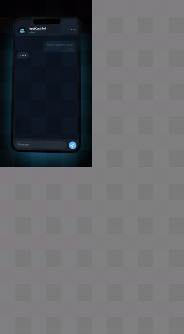

<div align="center">

# ProofCast

### No proof, no prod.

**Your AI agent writes the code. ProofCast makes it prove the feature runs — on video, in a real browser — before a single line reaches production.**

Evidence over assertion. **Proof before deploy.**


[Quickstart](#quickstart) · [How it works](#how-it-works) · [Principles](#principles) · [Vision](#vision)

<br/>

<!-- ▶ Replace this with a 20–30s screen capture: `Démo` → feature is built → proof.mp4 lands in Telegram → `Déploie`. -->


</div>

<br/>

> **An AI agent will happily ship code it never ran once.**
> ProofCast makes running it — and showing you the video — the price of reaching production.

---

## We automated writing code. We never automated trusting it.

In two years, generating software went from a novelty to a default. Agents scaffold, refactor, and ship while you watch a spinner. The one thing that didn't get automated is the part that actually protects you: **knowing it works.**

So we ship on vibes. A confident summary. A green check. A *"Done ✅."* The feature that was never opened in a browser goes to production because the model sounded sure.

None of the usual signals are evidence:

- **Passing tests** prove the code the model chose to test behaves the way the model expected. Green tests, broken feature — you've seen it.
- **A green CI badge** proves it *built*, not that it *works*.
- **"I ran it, looks good"** is gone the instant your terminal scrolls. Unrecorded, unshareable, unverifiable.
- **A screenshot** is a frozen frame. The bug lives in the interaction.
- **Reviewing the diff** means reading intent — not observing behavior.

The missing layer was never *more generation*. It's **proof**: durable, watchable evidence that the actual feature does the actual thing — enforced *before* the deploy, not apologized for after.

---

## How it works

ProofCast sits between your agent and production and enforces a single contract.

When a feature is ready, ProofCast:

1. **Generates** it with *your* model — a self-contained, runnable feature.
2. **Runs** it in a real Chromium browser via Playwright.
3. **Records** the feature actually being used, as an **MP4**.
4. **Delivers** that proof to your Telegram.

Then it waits. You watch a ten-second clip on your phone. If it's right, you reply **`Déploie`**. If no clip exists, **there is nothing to deploy** — `Déploie` is **blocked until a `Démo`** proof has been produced this session. No override. That gate *is* the product.

> `Démo` and `Déploie` are the two commands you send the bot — French for *Demo* and *Deploy*. They're the whole interface.

<table>
<tr>
<th align="left">Without ProofCast</th>
<th align="left">With ProofCast</th>
</tr>
<tr>
<td valign="top">

<pre>
you:    "add a signup page and ship it"
agent:  "Done ✅ — deployed to production."

you:    (opens the site, hopes)
        (it 500s on submit)
</pre>

</td>
<td valign="top">

<pre>
you:    "Démo a signup page"
agent:  🎬 building… 🎥 recording proof…
tg:     ▶ proof.mp4  ·  0:11
        (you watch it type an email and submit)
you:    "Déploie"
agent:  ✅ https://acme.vercel.app
</pre>

</td>
</tr>
</table>

---

## Principles

- **Evidence over assertion.** A recording of it working beats a paragraph claiming it does.
- **Deploy is earned, not assumed.** Production is gated on proof — the gate has no bypass.
- **The human stays in the loop, for the ten seconds that matter.** Watch, approve. Nothing else.
- **Your model, never ours.** ProofCast never pre-selects a provider or a model. You bring it; your environment decides.
- **Secrets never travel.** Keys stay in your environment; tokens are git-ignored on write; anything hitting disk is redacted first.

---

## Features

Not a checklist — the reasons ProofCast exists.

- **Proof that matches the feature.** A signup page gets an email typed in and submitted; a landing page gets scrolled; you can script any sequence. A login-form demo of a checkout flow proves nothing, so ProofCast doesn't do that.
- **A deploy gate with no escape hatch.** You cannot ship what you haven't watched work. `Déploie` stays blocked until a real `Démo` exists — the one rule the engine will not let you or the agent break.
- **Bring your own model.** Anthropic, OpenAI, Codex, or any OpenAI-compatible endpoint. ProofCast never picks the model, so you're never locked in and never surprised by a swap.
- **Set up by the agent you already use.** No config marathon. You open the project in your coding agent, say *"configure proofcast,"* and answer exactly one question: the bot's name.
- **A slow model can't hang the line.** A wall-clock backstop plus one retry keep every proof bounded — it either lands fast or fails fast with a reason, never spins forever.
- **It learns from its own mistakes.** Every failure is remembered (redacted) and fed back into the next prompt, so ProofCast doesn't trip on the same rock twice.
- **Glass box, not black box.** The engine narrates its reasoning to `proofcast-live.md` as it goes. When something breaks, you read exactly where it stood.
- **Secure by construction.** The Telegram token is git-ignored the instant it's written; every deploy argument is validated against injection before a command exists; secrets are masked before they touch disk.
- **Fast enough to stay in flow.** A proof is generated, recorded, and in your chat in well under a minute — delivered the moment it's encoded.

---

## Architecture

```
                         ┌─  ai         your model → a runnable feature (HTML)
        ┌──── bot ───────┤
setup ──┤  Démo / Déploie ├─  video      Playwright → real Chromium → MP4 proof
        │  the deploy gate │
onboarding                 ├─  deployer   vercel --prod, injection-checked
        │                  │
path-resolver              └─  memory     live context + cross-session learning, redacted
```

**The `Démo` pipeline**

```
Démo "a signup page"
   ├─ generate   your provider → a self-contained feature
   ├─ run        drive it in a real browser
   ├─ record     the real interaction → MP4
   └─ deliver    the proof lands in Telegram      ▶ marks the session demo-ready
```

**The `Déploie` gate**

```
Déploie
   ├─ proof this session?  ── no ──►  ✋ "Lance d'abord « Démo »."
   └─ yes ─►  vercel --prod  ─►  ✅ production URL
```

| Module | Responsibility |
|---|---|
| `bot` | Telegraf control surface; `Démo` / `Déploie`; enforces the deploy gate |
| `ai` | Multi-provider feature generation (Anthropic / OpenAI / custom); HTML extraction |
| `video` | Local server + Playwright recording → MP4; feature-adaptive demo |
| `deployer` | `vercel --yes --prod`, URL extraction, argument injection guard |
| `onboarding` | Bot naming, BotFather link, token persistence (git-ignored) |
| `path-resolver` | Safe, in-project folder resolution |
| `memory` | Live context + project-scoped learning, always redacted |
| `setup` | Readiness checks + next-action reporting |

---

## Quickstart

ProofCast is configured **by an AI coding agent**, not by hand.

1. **Open the project** in your agent — Claude Code, Codex, or Cursor.
2. **Say `configure proofcast`.** The agent reads [AGENTS.md](AGENTS.md), runs `npm run setup` (install, build, Chromium, readiness report), and drives the rest.
3. **Answer one question** — the bot's name — then paste the token BotFather gives you and finish the Vercel browser login when asked.
4. **Drive it from Telegram:** send `Démo` for a proof, `Déploie` to ship.

You bring **one AI provider** (ProofCast never pre-selects a model):

```bash
# Anthropic
export ANTHROPIC_API_KEY=...   ANTHROPIC_MODEL=...
# …or OpenAI / Codex / any OpenAI-compatible endpoint
export OPENAI_API_KEY=...      OPENAI_MODEL=...   # optional: OPENAI_BASE_URL
```

<details>
<summary><b>Prefer to wire it yourself?</b> The public API is small.</summary>

```ts
import { generateBotFatherLink, saveToken, startBot } from "proofcast";

const link = generateBotFatherLink(botName); // hand this to the user
saveToken(tokenFromUser);                    // validated + auto-gitignored (mode 600)
await startBot();                            // reads the token, resets live context, launches
```

`npm run setup` installs Chromium and prints a readiness report telling the agent exactly what's left.
</details>

---

## The agent's operating manual

ProofCast is unusual: it's operated by an AI agent, so it ships the agent a short list of things it must **never** do — because they're the things only a human can. These are hard rules, and they're mirrored in [AGENTS.md](AGENTS.md) / [CLAUDE.md](CLAUDE.md).

- **You cannot complete a browser OAuth flow for the user.** For `vercel login`, open it, then **WAIT** for the user to say **"j'ai terminé la connexion."** Never poll in a loop; never proceed alone.
- **Ask the user for exactly ONE thing: the bot name.** Nothing else.
- **NEVER ask for the Telegram token in the terminal.** Hand over a BotFather link; the user pastes the token back to you.
- **NEVER ask for (or re-request) the AI provider API key.** It already lives in the environment.
- **NEVER poll in an infinite loop** waiting on a human.

### NAVIGATION

When the user says *"work in the `example` folder,"* **NEVER ask the user for an absolute path.** Resolve it safely:

```ts
import { resolveTargetDirectory } from "proofcast";
const dir = await resolveTargetDirectory("travaille sur le dossier example");
```

It scans the project (skipping `node_modules`, `.git`, `dist`, …), picks the shallowest case-insensitive match, and **stays inside the project** — `../` and absolute paths in the hint are neutralized, never resolved. No match? It creates and returns `./proofcast-workspace`.

### Transparency & debugging

The bot writes its reasoning, in real time, to **`proofcast-live.md`** (reset each session, every line redacted). When it crashes, the user says **"lis le contexte de proofcast et corrige"** and you read the state at the moment it fell over:

```ts
import { getSessionContext } from "proofcast";
const state = getSessionContext(); // full contents of proofcast-live.md
```

### Memory

The bot learns across sessions from project-scoped memory at **`~/.proofcast/memory/<hash>.md`** (two projects never mix). Recent entries are injected back into the AI prompt, so mistakes aren't repeated — redacted before writing, capped so they never bloat a prompt.

> **Never delete this file between sessions.** It's the accumulated learning.

---

## Vision

Today, ProofCast proves one thing well: a **web feature, recorded in a real browser, before a Vercel deploy.**

The principle underneath is bigger than any single stack. As software starts to *write and ship itself*, the scarce resource stops being code and becomes **trust** — a reason to believe an autonomous action did what it claimed. The answer isn't slower agents. It's a receipt.

We think that becomes infrastructure. A world where *"the agent says it's done"* is replaced by *"here's the proof it's done."* Where every deploy, every migration, every irreversible action an AI takes carries evidence a human can watch in seconds and a system can verify in milliseconds.

ProofCast is the first brick: the proof-of-work layer between a model and the real world.

### Roadmap

Directions, not promises — and clearly not shipped yet:

- **More proof surfaces** beyond the browser: API calls, CLIs, background jobs.
- **Assertions on the recording** — *"the page reached this state"* — so a proof can fail, not just be watched.
- **Shareable proofs** — a link a teammate or reviewer can open.
- **More deploy targets** beyond Vercel, behind the same gate.
- **Pluggable proof stores** so evidence is retained, searchable, and auditable.

---

## Honest status

ProofCast is young. Here's exactly what's exercised for real versus mocked — no asterisks.

| Area | For real | Mocked / gated |
|---|---|---|
| Video recording + MP4 transcode | ✅ real Chromium + ffmpeg | — |
| Navigation · memory · onboarding | ✅ real file operations | — |
| AI feature generation | — | mocked providers (`npm run test:live` for real) |
| Vercel deploy | — | mocked `execSync` |
| Telegram send + bot launch | — | mocked handlers |

The full real pipeline (real model → real Telegram → real deploy) runs under **`npm run test:live`**, gated behind `PROOFCAST_LIVE=1` and your own credentials.

---

## API reference

<details>
<summary>Full public surface</summary>

| Module | Exports |
|---|---|
| `onboarding` | `generateBotFatherLink`, `saveToken`, `loadToken`, `maskToken` |
| `ai` | `generateFeature`, `extractHtmlDocument`, `createAnthropicProvider`, `createOpenAiProvider`, `resolveProvider` |
| `video` | `recordDemo`, `smartDemo`, `runDemoActions`, `autoFillDemoForm`, `hasDemoBeenGenerated` |
| `deployer` | `deployWithVercel`, `isVercelInstalled`, `extractDeploymentUrl` |
| `bot` | `startBot`, `buildBot`, `runDemoCommand`, `runDeployCommand` |
| `path-resolver` | `resolveTargetDirectory` |
| `memory` | `logLiveContext`, `getSessionContext`, `readMemory`, `writeMemory`, `redactSecrets` |
| `setup` | `checkReadiness`, `formatReadiness` |

</details>

---

## Development

```bash
npm install
npm run setup        # build + Chromium + readiness report
npm test             # 75 unit/integration tests — no network, no credentials
npm run test:live    # real AI / Telegram / Vercel — gated behind PROOFCAST_LIVE=1
```

External services are mocked and injected; Chromium and ffmpeg run for real. Contributions welcome — the seams are built for it.

---

<div align="center">

**If an AI is going to ship your code, make it prove the code works first.**

Star the repo if you believe verification is the next layer of the AI stack.

[MIT](LICENSE) © 2026 Guillaume Prévot

</div>
